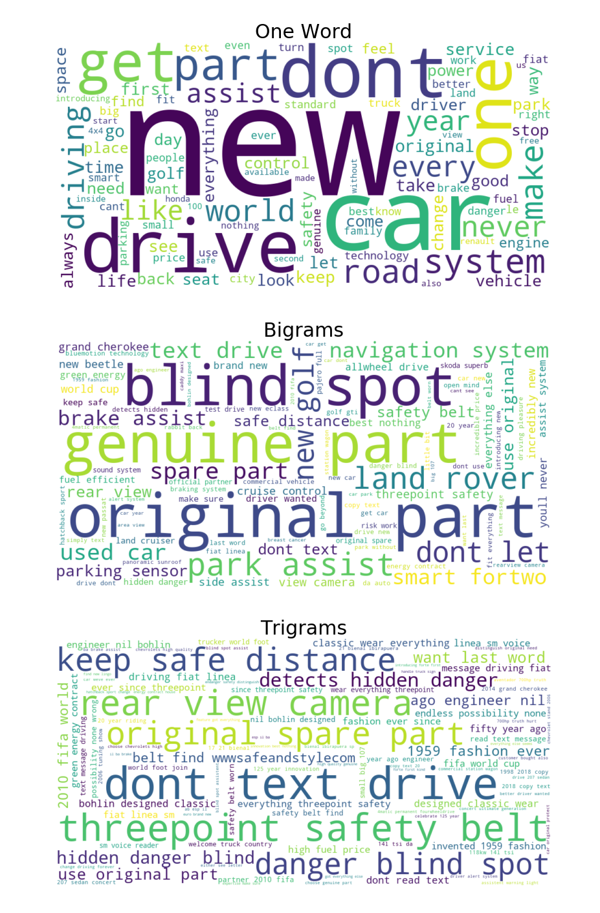
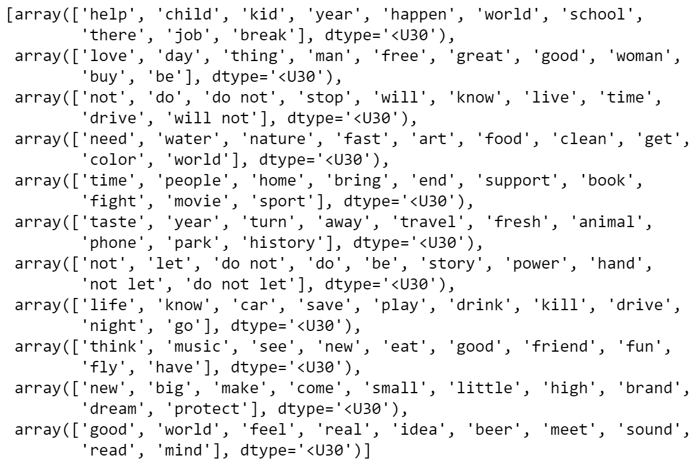
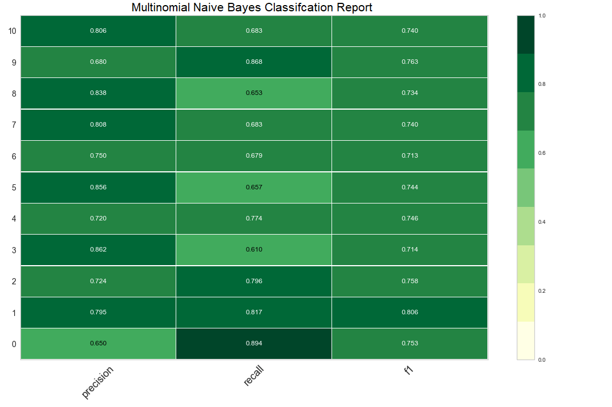

# DS-Final-Project
Predicting Topic of An Advertisement Based on Copy &amp; Deep Dive Analysis

## Summary
* Scraped approximately 146,000 advertisements from welovead.com[welovead.com] and stored in MongoDB
* Initially planned to predict industry of an ad, but through EDA discovered that there was a lot of overlap so new topics would need to be created
* Despite a lot of tinkering and playing with Latent Dirichlet Allocation and Non-Negative Matrix Factorization algorithms, was only able to yield topics that were relatively incoherent and hard to understand, concluding that they simply did not have enough text data to train on
* After settling on an LDA model that yielded 11 topics that still were not very discernible, visualizations of principal component analysis and singular value decomposition demonstrated that there were distinct clusters, so creating a model on which to predict seemed possible
* This hypothesis was correct, as a simple Multinomial Naive Bayes model was able to correctly classify topics roughly 75% of the time. More complex models like Random Forest, Support Vector Machines and XG Boost were test, but MNB outperformed them all

## Obtaining the Data
* Using Beautiful Soup, scraped about 146,000 pages for several different types of categorical and text data of advertisements including the actual copy(headline), industry, type of media, region and full description of the campaign.
* Below is an example of a page and the locations of the information scraped

   

* Stored all information in a NoSQL MongoDB

## Cleaning
* Since this online database seemed to be primarily for storing images of ads, unsurprisingly numerous records were missing the headline, description or both
* Additionally, several different pieces of creative were from the same campaign, and so there were a lot of duplicate values for text
    * After handling said null and duplicate values, data was reduced to about 38,000 rows and then 25,000 after it was decided to examine only headlines
* Since the website was rather messy, so was the data, which required a lot of manual cleaning, including many values under the industry column being labeled with the name of a company instead and many regions that were supposed to labeled with just a country also contained a city

## Exploratory Analysis
* Basic EDA showed that the U.S., Volkswagen, print media, and the Public Interest &amp; Non-Profit Sector dominated this data set as you can see in the charts below:

* Most common words, included 'new,' 'world', 'life' and 'help', which makes sense because so many ads are advertising a new product and the most common industry is non-profit
* Most common bigrams included 'don't let,' 'help us' and 'domestic violence' once again demonstrating the dominance of public interest/non-profit ads
* Examined common words in descriptions as well, but it seemed to be too contextual about the campaigns to be interesting
* Plotted word clouds of individual words, bigrams and trigrams by industry, which fully demonstrated how dirty and mislabeled the data was, meaning that creating new labels was necessary
* Below is an example of one of these series of clouds from the Automotive &amp; Services Industry

* For the most part this category seems relatively clean, but when looking trigrams in particular you can see some indications of ads that are labeled incorrectly, like 'don't text drive' is probably more for the non-profit/public interest industry

## Topic Modeling
* First experimented with clustering, but performance metrics were so poor (silhouette scores and elbow method), moved on to topic modeling, which is more ideal for text anyway
* Used Latent Dirichlet Allocation (LDA) algorithms in both Gensim and SciKit Learn libarires, also trying Non-Negative Matrix Factorization, but ultimately settled on LDA from SKlearn with a total of 11 topics (down from 21 industries)
* Unfortuantely these topics were pretty incoherent, which led me to the conclusion that the model simply was not fed enough text data to train properly as you can see below:

   

## Predicting Topics
* While it would be difficult to discern a practical use for these, I wanted to see if my original goal of predicting topics using copy was feasible, so I clustered the data and reduced dimensionality to 2 and 3 using principal component analysis and singular value decomposition
* Even though there is some overlap, as you can see in the below visualizations, there are several clear and distinct clusters, indicating that creating a predictive model was in fact possible!
 
 
* Knowing this, I moved forward to creating a supervised learning model, and fortunately the class imbalance in these new topics was relatively low
* A baseline Multinomial Naive Bayes model performed best on the data, yielding a 74.9% accuracy on the test data and 90.02% on training
* Experimented with Support Vector Machines, Random Forest and XG Boost classifier algorithms, and while XG approached MNB after tuning, it still ultimately performed worse, getting a higher accuracy on training (96.6%) and lower on test (70.2%)
* MNB was also very consistent across every class (topic) as well as the other evaluation metrics, scoring right around 0.75 in precision, recall and therefore F1, which you can see below in the confusion matrix and classification report

   

## Next Steps
* Naturally topic modelling is meaningless if said topics don't make any sense! So trying to account is essential
* More text data is needed for this, so I plan to use LDA on descriptions since there was so much more in there
* Another option would to be gather more ad copy data, but since I scraped my initial source for everything it had, I would need to find another one, which might be impossible without paying for it
